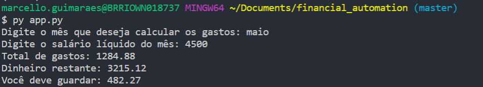
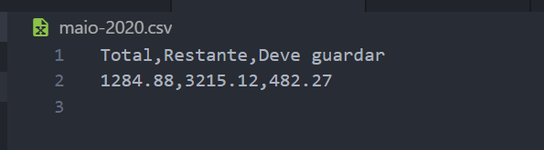

## A script to automate calculation of monthly financial expenses.
Given a salary a file with expenses amount, it prints in the console and create a .csv file with the total amount, remaining amount and advises to invest a percentage of the remaining amount.

